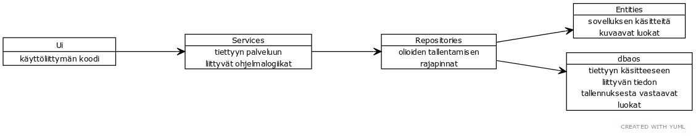
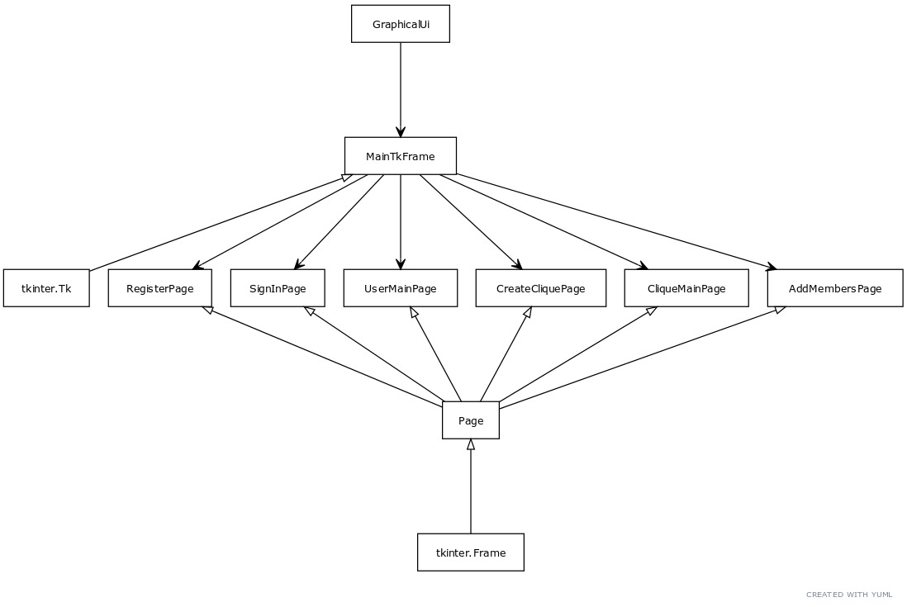
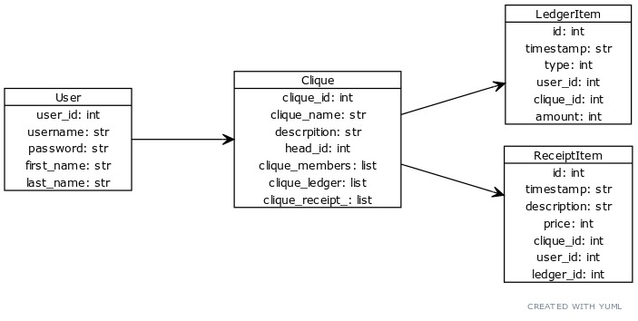

# Arkkitehtuurikuvaus #
## Rakenne ##
Sovelluksen ohjelmakoodin rakenne noudattaa nelitasoista kerrosarkkitehtuuria. Sovelluksen pakkaurakenne on seuraava:

Pakkaus _ui_ sisältää käyttöliittymään liittyvän koodin, _services_ sisältää eri palveluille kuuluvan ohjelmalogiikan luokat, _repositories_ sisältää oliotason tallentamiseen ja noutamiseen liittyvät luokat (toimii yhdys-noodina _entities_, _dbaos_ pakkauksille), _entities_ sisältää erilaisia sovelluksessa pyöriteltävä käsitteitä kuvaavat luokat, _dbaos_ sisältää eri sovelluksen käsitteisiin liittyvän datan tietokantaan tallentavien luokkien, niin sanottujen dbao:jen eli "DataBase Access Object" luokkien koodin. Erilaiset dbaot ovat viimekädessä vastuussa kaiken tiedon tallentamisesta (paikalliseen) tietokantaan.

## Käyttöliittymä ##

Graafinen käyttöliittymä sisältää kuusi erillistä näkymää:

- Rekisteröityminen (RegisterPage)
- Kirjautuminen (SignInPage)
- Käyttäjän päänäkymä (UserMainPage)
- Uuden klikin luominen (CreateCliquePage)
- Klikin sisäinen näkymä (CliqueMainPage)
- Lisää jäseniä näkymä (AddMembersPage)

Graafisen käyttöliittymän koodi on eriytetty kokonaan sovelluslogiikasta, sekä jaettu eri luokkiin. Päälimmäisenä on _GraphicalUi_ luokka joka käynnistää _Tkinter_ kirjaston koodia. Se tekee niin kutsumalla _MainTkFrame_ eli ns.hallitsijaruutua joka perii toiminnallisuutta Tkinter kirjastosta. Tämä hallitsija päättää mikä sivu on päällä milläkin hetkellä. Tämä hallitsija pitää kirjaa kaikista luoduista sivuista, ja vuorotellen pyytää niitä nousemaan näkyviin kun käyttäjä tekee erilaisia toimintoja käyttöliittymässä. Sivut käyttävät ohjelmalogiikkaa juuri tämän hallitsijan hallussa olevien viitteiden kautta. Jokainen sivu on erillinen luokka (nimetty <toiminnallisuus>_Page_), joka kuvaa sivun rakenteen ja toiminnallisuuden. Kun sivu haluaa vaihtaa sivua itsestään toiseen, se pyytää hallitsijaansa vaihtamaan sivua johonkin tiettyyn toiseen sivuun, ja hallitsija toteuttaa tämän. Jokainen sivu perii luokan _Page_ joka pitää kirjaa omasta hallitsijaluokasta, sekä ns. vanhemmasta, joka kertoo mikä Tkinterin ruutu kyseisen sivun pitää sisällään (molemmat näistä ovat aina samat, mutta tätä rakennetta olisi helpompi laajentaa entistä isommaksi). _Page_ luokka puolestaan perii Tkinterin _Frame_ luokan, joka kuvaa graafisen käyttöliittymän raamia, jonka sisälle voi asettaa elementtejä ja näin käsitellä niitä kokonaisuutena.
  

## Sovelluslogiikka ##

Sovelluksen loogisen tietomallin muodostavat User, Clique, LedgerItem ja ReceiptItem. Nämä kuvaavat käyttäjiä (User), klikkejä eli ryhmiä (Clique), ryhmän velkakirjamerkintää (LedgerItem) ja ryhmän hankintamerkintää (ReceiptItem). Jokainen luokka pitää sisällään sille kokonaisuudelle oleelliset tiedot ja toiminnot.

Luokat esittävät omia abstraktion tasojaan ja tekevät sille ominaisia asioita. 
