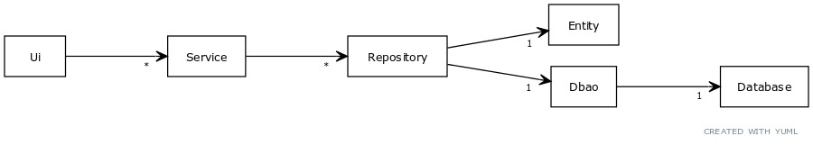

# Arkkitehtuurikuvaus #

## Rakenne ##

Sovelluksen ohjelmakoodin rakenne noudattaa nelitasoista kerrosarkkitehtuuria. Sovelluksen pakkaurakenne on seuraava:

Pakkaus _ui_ sisältää käyttöliittymään liittyvän koodin, _services_ sisältää eri palveluille kuuluvan ohjelmalogiikan luokat, _repositories_ sisältää oliotason tallentamiseen ja noutamiseen liittyvät luokat (toimii yhdys-noodina _entities_, _dbaos_ pakkauksille), _entities_ sisältää erilaisia sovelluksessa pyöriteltävä käsitteitä kuvaavat luokat, _dbaos_ sisältää eri sovelluksen käsitteisiin liittyvän datan tietokantaan tallentavien luokkien, niin sanottujen dbao:jen eli "DataBase Access Object" luokkien koodin. Erilaiset dbaot ovat viimekädessä vastuussa kaiken tiedon tallentamisesta (paikalliseen) tietokantaan.

## Käyttöliittymä ##

Graafinen käyttöliittymä sisältää kuusi erillistä näkymää:

- Rekisteröityminen (RegisterPage)
- Kirjautuminen (SignInPage)
- Käyttäjän päänäkymä (UserMainPage)
- Uuden klikin luominen (CreateCliquePage)
- Klikin sisäinen näkymä (CliqueMainPage)
- Lisää jäseniä näkymä (AddMembersPage)

Graafisen käyttöliittymän koodi on eriytetty kokonaan sovelluslogiikasta, sekä jaettu eri luokkiin. Päälimmäisenä on _GraphicalUi_ luokka joka käynnistää _Tkinter_ kirjaston koodia. Se tekee niin kutsumalla _MainTkFrame_ eli ns.hallitsijaruutua joka perii toiminnallisuutta Tkinter kirjastosta. Tämä hallitsija päättää mikä sivu on päällä milläkin hetkellä. Tämä hallitsija pitää kirjaa kaikista luoduista sivuista, ja vuorotellen pyytää niitä nousemaan näkyviin kun käyttäjä tekee erilaisia toimintoja käyttöliittymässä. Sivut käyttävät ohjelmalogiikkaa juuri tämän hallitsijan hallussa olevien viitteiden kautta. Jokainen sivu on erillinen luokka (nimetty _\<toiminnallisuus\>_ Page), joka kuvaa sivun rakenteen ja toiminnallisuuden. Kun sivu haluaa vaihtaa sivua itsestään toiseen, se pyytää hallitsijaansa vaihtamaan sivua johonkin tiettyyn toiseen sivuun, ja hallitsija toteuttaa tämän. Jokainen sivu perii luokan _Page_ joka pitää kirjaa omasta hallitsijaluokasta, sekä ns. vanhemmasta, joka kertoo mikä Tkinterin ruutu kyseisen sivun pitää sisällään (molemmat näistä ovat aina samat, mutta tätä rakennetta olisi helpompi laajentaa entistä isommaksi). _Page_ luokka puolestaan perii Tkinterin _Frame_ luokan, joka kuvaa graafisen käyttöliittymän raamia, jonka sisälle voi asettaa elementtejä ja näin käsitellä niitä kokonaisuutena.
  

## Sovelluslogiikka ##

Sovelluksen loogisen tietomallin muodostavat User, Clique, LedgerItem ja ReceiptItem. Nämä kuvaavat käyttäjiä (User), klikkejä eli ryhmiä (Clique), ryhmän velkakirjamerkintää (LedgerItem) ja ryhmän hankintamerkintää (ReceiptItem). Jokainen luokka pitää sisällään sille kokonaisuudelle oleelliset tiedot ja toiminnot.

Tietomallin osat muodostavat tärkeät käsitteet ohjelmalle. Mutta jokaisen tällaisen yhden käsitteen ympärille on luotava absrtaktiohierarkia, jotta saadaan yhdistettyä käsitteiden abstrakti käsittely käyttöliittymän päässä, mutta niin että jokainen toiminto johtuu alhaisemman abstraktiotason toiminnoiksi tietokannan päässä. Tätä kuvaa hyvin abstraktiokaavio, joka esittelee erilaiset luokkatasot jotka toteuttavat tarpeellista abstraktion tasoa.

Jokaista tasoa toteuttaa yksi tai useampi konkreettinen luokka, joka tekee tuon abstraktiotason tehtävää, mutta vain oman käsitteensä alueella. Luokat esittävät omia abstraktion tasojaan ja tekevät sille ominaisia asioita. Ainut kohta kaaviossa jolle ei ole tässä tarkoitettua luokkaa on _Database_ taso, joka on siis ihan oikea tietokanta. Näillä saavutetaan rakenne, jossa jokaisella luokalla on yksi ja ainut selkeä tehtävä. Jos nämä kaksi edellistä kaaviota laitetaan yhteen, saadaan seuraavanlainen luokkakaavio.

Luokkakaavio ilmentää ns. _Single responibility_ käsitettä hyvin. Jokainen osanen tekee omaa selkeää osaa, ja viestit liikkuvat tätä puumaista rakennetta ylös ja alas, niin että juuressa voimme käsitellä abstrakteja käsitteitä, jotka sitten peilautuvat monimutkaisempina toimintoina tietokannan päässä. Tässä välissä sitten Entities luokkien objektit toimivat sovelluksessa tietokannan tietojen ajonaikaisina ilmentyminä, ja peilaavat sinne tallennettua dataa. Kaikki muutokset tietoihin tallentuvat kuitenkin heti muutoksen tapahduttua tietokantaan.

## Tietojen pysyväistallennus ##

Pakkauksen dbaos _\<Entity\>_ Dbao luokat pitävät huolta tietojen pysyväistallennuksesta. Ne pitävät huolta omasta tontistaan ja tallentavat ja hakevat tietoa heihin itseensä liittyvistä asioista. Nimensä mukaisesti DataBase Access Object oliot tallentavat tietoa tietokantaan. Nyt käytössä on paikallinen Sqlite3 tietokanta, mutta yhtä hyvin tätä toiminnallisuutta voitaisiin jatkaa muokkaamalla  _\<Entity\>_ Dbao luokkia ottamaan yhteyttä oikeaan titokantaan verkon yli.

## Tiedostot ##

Sovellus tallentaa kaiken sovelluksen datan paikallisiin Sqlite3 tietokantatiedostoihin. Tietokantatiedosto voi sijaita joko levyllä, tai haipuvassa keskusmuistissa. Oletuksena sovellus luo tietokantatiedoston ohjelmiston juurikansioon _data_ kansion alle nimellä `data.db`. Tätä oletustoiminnallisuutta voi muuttaa, muuttamalla `config.py` tiedoston muuttujia `DB_TYPE` joko arvoon _"sqlite3_file"_ tai _"sqlite3_in_memory"_, tai muuttujan `DB_PATH` haluttuun polkusijaintiin, johon tiedosto tallennetaan (oletuksena `"data/data.db"`).

## Päätoiminnallisuudet ##

Kuvataan seuraavaksi muutamaa sovelluksen perustoiminnallisuutta sekvenssikaavion avulla:

### Uuden käyttäjätilin luominen ###

Jatketaan tästä

### Käyttäjän kirjautuminen ###
### Cliquen luominen ###
### Jäsenen Lisääminen ###
### Ostoksen lisääminen ###
### Velan maksaminen ###
### Saatavan saaminen ###
