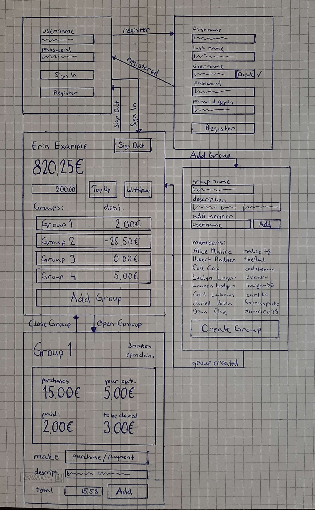

# Vaatimusmäärittely #

## Sovelluksen tarkoitus ##
Sovelluksen on tarkoitus toimia apuvälineenä ryhmän yhteisten hankintojen aikaansaaman rahaliikenteen selvittämiseen. Käyttäjät voivat luoda ryhmiä joihin voi lisätä palveluun liittyneitä käyttäjiä. Ryhmälle voi jokainen ryhmän jäsen lisätä ostoksia, joita on itse ryhmän hyväksi tehnyt. Sovellus pitää kirjaa ostoksista ja laskee niiden kulut tasaisesti kaikille ryhmän jäsenille. Sovellus kertoo käyttäjälle, kuinka paljon hän on velkaa ryhmälle. Kulut "maksetaan" ryhmään, josta se palauttaa rahaa ryhmän käyttäjille niin, että kaikki ovat maksaneet ryhmän kulut tasapuolisesti.

## Käyttäjäroolit ##
Käyttäjärooleja on aluksi vain yksi, eli *normaali käyttäjä*. Myöhemmin sovellukseen voidaan lisätä ylläpitäjä, joka toimii suuremmilla oikeuksilla, ja voi esimerkiksi perua ostoksia ja maksuja, sekä poistaa ryhmiä.

## Käyttöliittymäluonnos ##
Miltä käyttöliittymä tulisi näyttämään

## Toiminnallisuus ##
### Kirjautuminen/rekisteröinti ###
- jos käyttäjä on uusi, voi hän voi luoda järjestelmään käyttäjätunnuksen                         -\<tehty\>-
  - käyttäjä ohjataan erilliselle ruudulle rekisteröitymään                                       -\<tehty\>-
  - käyttäjältä pyydetään etu- ja sukunimeä, sekä pyydetään keksimään käyttäjätunnus ja salasana  -\<tehty\>-
- käyttäjä voi kirjautua järjestelmään jos hänellä on tunnukset                                   -\<tehty\>-
  - kirjautuminen tapahtuu käyttäen käyttäjätunnusta ja salasanaa                                 -\<tehty\>-
- kirjautumisprosessin onnistuessa käyttäjä päästetään sisään                                     -\<tehty\>-
### Päänäkymä ###
- käyttäjä näkee päänäkymässä
  - oman nimen                                                                                    -\<tehty\>-
  - sovelluksessa olevan oman tilin saldon                                                        -\<tehty\>-
  - mahdollisuuden tallettaa tai nostaa varoja                                                    -\<tehty\>-(vasta visuaaliset elementit)
  - ryhmät joissa hän on jäsenenä                                                                 -\<tehty\>-(Jotka hän omistaa)
    - jokaiseen ryhmään liittyvän velkatilanteen                                                  -\<tehty\>-(Joka on vielä aina 0)
    - jokaisen ryhmän voi klikata auki, jolloin pääsee ryhmänäkymään
  - mahdollisuuden lisätä uusi ryhmä                                                              -\<tehty\>-
  - mahdollisuuden kirjautua ulos                                                                 -\<tehty\>-
- tiedot päivittyvät päänäkymään aina sivun auetessa                                              -\<tehty\>-(toteutetun toiminnan puolesta)
### Ryhmän lisäys ###
- lisätäkseen uuden ryhmän, jäyttäjältä pyydetään
  - ryhmän nimi                                                                                   -\<tehty\>-
  - ryhmän kuvaus                                                                                 -\<tehty\>-
  - lisäämään käyttäjiä
    - käyttäjät lisätään yksi kerrallaan
    - voi lisätä vain järjestelmässä jo olevia käyttäjiä
- kun ryhmä on valmis
  - se luodaan nappia painamalla'                                                                 -\<tehty\>-
  - ryhmää ei voi sen jälkeen enää muokata                                                        -\<tehty\>-
### Ryhmänäkymä ###
- käyttäjä näkee päänäkymässä
  - ryhmän nimen
  - ryhmän jäsenten määrän
  - onko ryhmässä avoimia saatavia
  - ostoihin ja velkoihin liittyvää tietoa
    - ostojen kokonaissumman
    - oman osuuden kokonaissummasta
    - oman maksetun määrän
    - jäljelle jäävien saatavien määrä
  - mahdollisuus suorittaa uusi maksu ryhmälle, tai ilmoittaa uudesta ostoksesta

## Jatkokehitysideoita ##
Sovellus on hyvin raakile, ja siihen voisi lisätä todella paljon erilaisia toimintoja ja ominaisuuksia. Nämä tekisivät siitä jopa oikeasti käytännöllisen sovelluksen talouden hoitoon ryhmässä.

Joitain esimerkkejä:
  - ryhmien muokkaus jälkikäteen
  - ryhmän uusien ostosten hyväksyttäminen kaikilla jäsenillä
  - ostosten ja maksujen tarkastelu ryhmän sisällä
  - aliryhmien toteuttaminen

Korkealentoisia esimerkkejä:
  - salasanojen ja käyttäjätunnusten oikeaoppinen säilyttäminen
  - tuotteiden automaattinen lukeminen kuitista
  - oikean maksuliikenteen toteuttaminen sovelluksen kautta
